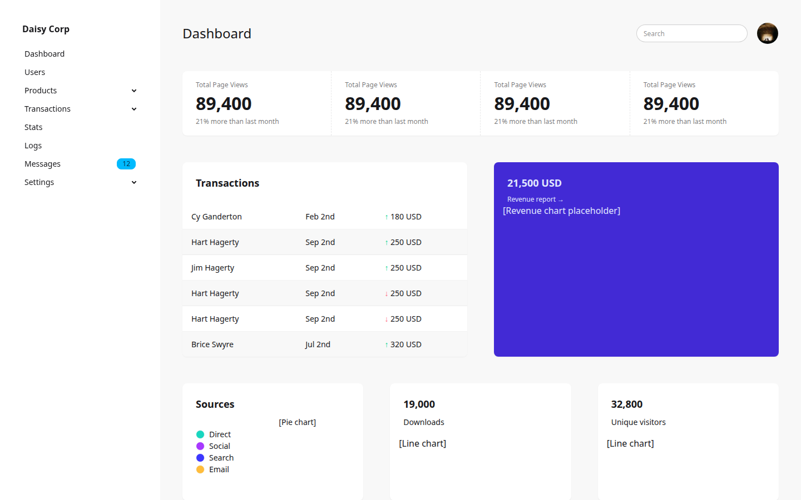

# kdaisyUI

Type-safe [DaisyUI](https://daisyui.com/) components for [kotlinx.html](https://github.com/Kotlin/kotlinx.html).

Write DaisyUI markup in Kotlin with autocompletion, compile-time checks, and zero class-name typos.



```kotlin
createHTML().div {
    daisyCard(extraClasses = "bg-base-100 shadow-xs") {
        daisyCardBody {
            daisyCardTitle("Revenue")
            daisyStats {
                daisyStat {
                    daisyStatValue("21,500 USD")
                    daisyStatDesc("21% more than last month")
                }
            }
            daisyButton("View report", variant = ButtonVariant.Primary)
        }
    }
}
```

## Who is this for?

Kotlin developers building **server-rendered HTML** (with Ktor, Spring, or any JVM framework) who want beautiful, consistent UIs without writing raw CSS class strings.

No frontend build tools required. No JavaScript frameworks. Just Kotlin.

## Documentation

This project follows the [Diátaxis](https://diataxis.fr/) documentation framework:

| | Learn | Work |
|---|---|---|
| **Hands-on** | [Tutorials](docs/tutorials/) — step-by-step lessons | [How-to guides](docs/how-to.md) — solve specific tasks |
| **Theory** | [Explanation](docs/explanation.md) — background concepts | [Reference](docs/reference.md) — complete API |

### Quick links

- **New here?** Start with the [Getting started tutorial](docs/tutorials/getting-started.md)
- **Want to build a real app?** Follow [Build a dashboard with Ktor](docs/tutorials/build-a-dashboard.md)
- **Need a specific recipe?** Check the [How-to guides](docs/how-to.md)
- **Looking up an API?** See the [Component reference](docs/reference.md)

## Quick start

### 1. Add the dependency

No published artifacts yet — use a Gradle composite build:

```kotlin
// settings.gradle.kts
includeBuild("../kdaisyUI")

// build.gradle.kts
dependencies {
    implementation(project(":lib"))
}
```

### 2. Render your first component

```kotlin
import kdaisyui.components.*
import kotlinx.html.div
import kotlinx.html.stream.createHTML

val html = createHTML().div {
    daisyButton("Click me", variant = ButtonVariant.Primary, size = ButtonSize.Lg)
}
// → <div><button class="btn btn-primary btn-lg">Click me</button></div>
```

## Modules

| Module | Description |
|---|---|
| `:lib` | Core library — DSL component wrappers |
| `:example-app` | Ktor + htmx demo dashboard |

## Requirements

- JDK toolchain: **25**
- Kotlin: **2.3.10**
- kotlinx-html: **0.12.0**

## Run the example

```bash
./gradlew :example-app:run
# → http://localhost:8080
```

## License

MIT. See [LICENSE](LICENSE).
