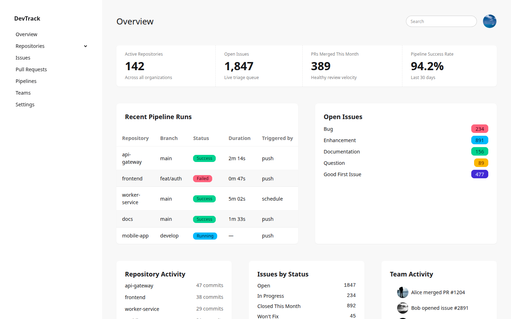

# kdaisyui

[](https://central.sonatype.com/artifact/io.github.ollin.kdaisyui/kdaisyui)

Type-safe [DaisyUI](https://daisyui.com/) components for [kotlinx.html](https://github.com/Kotlin/kotlinx.html).

Write DaisyUI markup in Kotlin with autocompletion, compile-time checks, and zero class-name typos.



```kotlin
createHTML().div {
    daisyCard(extraClasses = "bg-base-100 shadow-xs") {
        daisyCardBody {
            daisyCardTitle("Revenue")
            daisyStat(horizontal = true) {
                daisyStatStat {
                    daisyStatStatValue("21,500 USD")
                    daisyStatStatDesc("21% more than last month")
                }
            }
            daisyButton("View report", variant = ButtonVariant.Primary)
        }
    }
}
```

## Who is this for?

Kotlin developers building **server-rendered HTML** (with Ktor, Spring, or any JVM framework) who want beautiful, consistent UIs without writing raw CSS class strings.

No frontend build tools required. No JavaScript frameworks. Just Kotlin.

## Documentation

This project follows the [Diátaxis](https://diataxis.fr/) documentation framework:

| | Learn | Work |
|---|---|---|
| **Hands-on** | [Tutorials](docs/tutorials/index.md) — step-by-step lessons | [How-to guides](docs/how-to.md) — solve specific tasks |
| **Theory** | [Explanation](docs/explanation.md) — background concepts | [Reference](docs/reference.md) — complete API |

### Quick links

- **New here?** Start with the [Getting started tutorial](docs/tutorials/getting-started.md)
- **Want to build a real app?** Follow [Build a dashboard with Ktor](docs/tutorials/build-a-dashboard.md)
- **Need a specific recipe?** Check the [How-to guides](docs/how-to.md)
- **Looking up an API?** See the [Component reference](docs/reference.md)

> Published to [Maven Central](https://central.sonatype.com/artifact/io.github.ollin.kdaisyui/kdaisyui). Use the latest version shown on the badge above (or build from source with `just build`).

## Quick start

### 1. Add the dependency

```kotlin
// build.gradle.kts
repositories {
    mavenCentral()
}

dependencies {
    // Import the BOM once (replace VERSION with the latest release), then declare
    // the artifacts without versions — the BOM keeps them aligned.
    implementation(platform("io.github.ollin.kdaisyui:kdaisyui-bom:VERSION"))
    implementation("io.github.ollin.kdaisyui:kdaisyui")
    implementation("io.github.ollin.kdaisyui:kdaisyui-ktor-integration") // optional: Ktor Resources integration
}
```

> **Note:** Released to Maven Central via JReleaser. The latest version is shown on the badge at the top of this README.

### 2. Render your first component

```kotlin
import io.github.ollin.kdaisyui.components.*
import kotlinx.html.div
import kotlinx.html.stream.createHTML

val html = createHTML().div {
    daisyButton("Click me", variant = ButtonVariant.Primary, size = ButtonSize.Lg)
}
// → <div><button class="btn btn-primary btn-lg">Click me</button></div>
```

## Modules

| Module | Description |
|---|---|
| `:lib` | Core library — DSL component wrappers (published as `kdaisyui`) |
| `:ktor-integration` | Ktor Resources integration; brings DaisyUI/Tailwind/htmx webjars transitively (published as `kdaisyui-ktor-integration`) |
| `:bom` | Bill of Materials aligning the two artifact versions (published as `kdaisyui-bom`) |
| `:example-app` | Ktor + htmx demo dashboard |

## Development environment

### Option A — Local with asdf

```bash
git clone https://github.com/ollin/kdaisyui
cd kdaisyui
asdf install   # reads .tool-versions — installs the JDK
just test      # run unit tests
just dev       # start dev server → http://localhost:8080
```

Building and testing needs **only a JDK**. The components and icons are generated, but the
generated sources are committed, so there is no Node, no npm and no git submodule in the way
of a clone. Only `just generate` — regenerating after a DaisyUI or Heroicons bump — needs
Node and the submodules.

### Option B — Any JDK 21+

The Gradle wrapper downloads Gradle automatically (version in [`gradle/wrapper/gradle-wrapper.properties`](gradle/wrapper/gradle-wrapper.properties)). Just bring your own JDK 21+.

## Requirements

Exact versions are the single source of truth in these files:

| What | Where |
|---|---|
| JDK that runs Gradle | [`.tool-versions`](.tool-versions) |
| Kotlin, kotlinx-html | [`gradle.properties`](gradle.properties) |
| Gradle wrapper | [`gradle/wrapper/gradle-wrapper.properties`](gradle/wrapper/gradle-wrapper.properties) |
| Ktor, webjars | [`example-app/build.gradle.kts`](example-app/build.gradle.kts) |

## Common tasks

This project uses [`just`](https://just.systems/) as a task runner. Run `just` to list all recipes.

| Command | What it does |
|---|---|
| `just dev` | Start the example app → http://localhost:8080 |
| `just test` | Run library unit tests |
| `just e2e` | Run Playwright E2E tests (server managed automatically) |
| `just test-all` | Run unit tests + E2E tests |
| `just build` | Build all Gradle modules |
| `just clean` | Remove all build artifacts |

`just generate` regenerates the committed sources in `lib/generated` and shows the resulting
diff; it is the only recipe that needs Node and the git submodules. The raw Gradle commands
still work if you prefer them directly.

## AI support

This project ships AI-ready context files so AI tools can work with kdaisyui effectively:

| Audience | File | Purpose |
|---|---|---|
| Contributors (all AI tools) | [`AGENTS.md`](AGENTS.md) | Single source of truth: conventions, codegen, tooling, anti-patterns |
| Claude Code | [`CLAUDE.md`](CLAUDE.md) | Thin pointer to AGENTS.md |
| Library users (any AI) | [`llms.txt`](llms.txt) | API reference for consuming the library |

If you're using kdaisyui as a dependency and want AI assistance, point your AI tool to [`llms.txt`](llms.txt).

## License

MIT. See [LICENSE](LICENSE).

## Acknowledgements

[DaisyUI](https://daisyui.com/) by [Pouya Saadeghi](https://github.com/saadeghi) is the reason this library exists — making Tailwind CSS semantic is genuinely great work. See [CREDITS.md](CREDITS.md) for full acknowledgements of all projects this library builds on.
