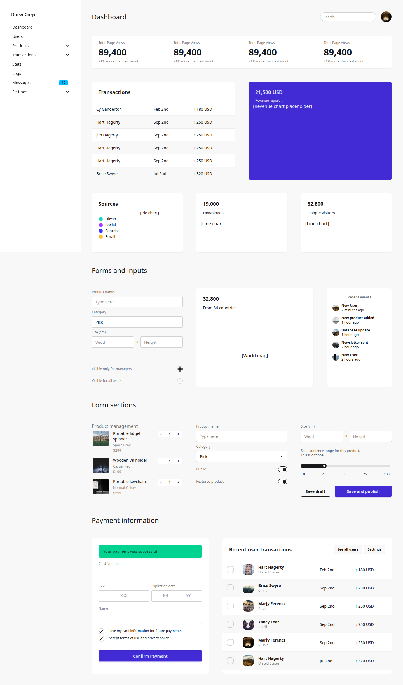

# Understanding kdaisyUI

Background concepts, design decisions, and how the pieces fit together.

## What is DaisyUI?

[DaisyUI](https://daisyui.com/) is a CSS component library built on top of Tailwind CSS. It provides semantic class names — `btn`, `btn-primary`, `card`, `stat`, `menu` — that style HTML elements without writing custom CSS.

A DaisyUI button is just:

```html
<button class="btn btn-primary btn-lg">Save</button>
```

There is no JavaScript. No runtime. No component tree. Just CSS classes applied to standard HTML elements. This makes DaisyUI ideal for server-rendered applications where the server produces the full HTML.

DaisyUI covers common UI patterns: buttons, cards, forms, tables, navigation, modals, alerts, stats, avatars, badges, and more. Each component is a set of CSS classes that follow a consistent naming convention.

## What is kotlinx.html?

[kotlinx.html](https://github.com/Kotlin/kotlinx.html) is Kotlin's official library for building HTML in a type-safe way. Instead of string templates:

```kotlin
// Fragile — typos, missing closing tags, no IDE help
val html = "<div class=\"card\"><h2>Title</h2></div>"
```

You write:

```kotlin
// Type-safe — compiler checks tags, IDE autocompletes attributes
createHTML().div("card") {
    h2 { +"Title" }
}
```

Every HTML tag is a function. Every attribute is a typed property. The compiler catches mistakes. The IDE provides autocompletion. The generated HTML is guaranteed to be well-formed.

kotlinx.html works on the JVM (for server-side rendering with Ktor, Spring, etc.) and in Kotlin/JS (for browser-side rendering).

## What is htmx?

[htmx](https://htmx.org/) is a small JavaScript library (~14KB) that extends HTML with attributes for making HTTP requests and updating the page. Instead of building a JSON API and a client-side JavaScript application, you let the server return HTML fragments and htmx handles inserting them into the DOM.

Three attributes cover most use cases:

- `hx-get="/url"` — make a GET request to this URL
- `hx-trigger="load"` — when to make the request (on page load, on scroll, on click, etc.)
- `hx-swap="outerHTML"` — how to insert the response (replace element, insert inside, append, etc.)

This fits naturally with server-rendered Kotlin applications: the server already produces HTML, and htmx lets you send smaller fragments instead of full pages.

## Why kdaisyUI exists

Using DaisyUI with kotlinx.html directly works, but it's verbose and error-prone:

```kotlin
// Without kdaisyUI — manual class strings
button {
    classes = setOf("btn", "btn-primary", "btn-lg")
    +"Save"
}
```

Problems with this approach:

- **No compile-time checks**: `"btn-priary"` is a silent typo that produces unstyled output
- **No IDE autocompletion**: you need to remember every class name
- **No semantic API**: the intent ("primary large button") is hidden in class strings
- **Class merging is fragile**: combining classes from multiple sources can produce duplicates or clobber the `class` attribute

kdaisyUI solves all four:

```kotlin
// With kdaisyUI — typed, composable, correct
daisyButton("Save", variant = ButtonVariant.Primary, size = ButtonSize.Lg)
```

The variant is an enum — the compiler rejects invalid values. The IDE autocompletes options. The generated class string is always correct.

## How class merging works

The core utility function `addClassNames` (in `kdaisyui.core`) manages the `class` attribute safely:

1. Reads the existing `class` attribute
2. Splits it into tokens
3. Adds new tokens (deduplicating)
4. Handles null, blank, and whitespace-only inputs
5. Uses `LinkedHashSet` to preserve insertion order

When you write `daisyButton(variant = ButtonVariant.Primary, extraClasses = "w-full mt-4")`, the function builds the class attribute step by step:

```
"btn"                     ← base class (always present)
"btn btn-primary"         ← variant added
"btn btn-primary w-full mt-4"  ← extra classes merged
```

This means you can safely add Tailwind utilities, custom classes, or any CSS class without worrying about duplicates or broken attributes.

## Architecture: thin wrappers, not abstractions

Each kdaisyUI component function is a thin wrapper around the corresponding HTML tag:

- `daisyButton` calls `button { }` and adds `class="btn ..."`
- `daisyCard` calls `div { }` and adds `class="card ..."`
- `daisyTable` calls `table { }` and adds `class="table ..."`

There is no virtual DOM, no component tree, no lifecycle, no state management. The functions exist solely to add the right CSS classes with a typed API.

This design has consequences:

- **Zero runtime overhead**: the wrappers execute during HTML generation, producing the same output as hand-written kotlinx.html
- **Full kotlinx.html compatibility**: you can mix DSL components with raw kotlinx.html freely
- **No lock-in**: if kdaisyUI doesn't support something, you drop to raw kotlinx.html

## The escape hatch pattern

Every component follows the same parameter pattern:

```kotlin
fun FlowContent.daisyComponent(
    // Typed DaisyUI parameters
    variant: ComponentVariant? = null,
    size: ComponentSize? = null,
    // Boolean modifiers
    outline: Boolean = false,
    // Escape hatches
    extraClasses: String? = null,        // add any CSS class
    attrs: (TAG.() -> Unit)? = null,     // set any HTML attribute
    content: (TAG.() -> Unit)? = null,   // add any nested HTML
)
```

The escape hatches ensure the DSL never limits you:

- **`extraClasses`**: add Tailwind utilities (`"w-full mt-4"`), custom classes, or responsive variants (`"lg:btn-lg"`)
- **`attrs`**: set `id`, `data-*` attributes, event handlers — anything the raw tag supports
- **`content`**: nest arbitrary HTML inside the component — icons, images, other components

If DaisyUI adds a new modifier tomorrow, you can use it immediately via `extraClasses` without waiting for a kdaisyUI update.

## How it fits together: Ktor + kdaisyUI + htmx

The three technologies form a clean server-rendering stack:

```
Browser ──── htmx ────► Ktor server ──── kotlinx.html + kdaisyUI ────► HTML
  │                        │
  │  hx-get="/stats"       │  call.respondHtml { daisyStats { ... } }
  │  ◄── HTML fragment ────│
  │                        │
  └── inserts into DOM     └── generates HTML string
```

1. **Ktor** handles HTTP routing and request/response
2. **kotlinx.html** provides the type-safe HTML builder
3. **kdaisyUI** adds DaisyUI component wrappers on top of kotlinx.html
4. **htmx** on the client triggers requests and swaps HTML fragments

The server is the single source of truth for all UI rendering. There is no client-side state, no client-side routing, no JavaScript build step. The browser receives HTML and displays it.

The result is a fully styled, interactive dashboard — rendered entirely on the server:


