# Component reference

Type-safe [DaisyUI](https://daisyui.com/) components for [kotlinx.html](https://github.com/Kotlin/kotlinx.html).
All components are extension functions on `FlowContent`:

```kotlin
import com.github.ollin.kdaisyui.components.*
```

---

## All components

<table>
<tr>
<td align="center" width="200">
<a href="#alert">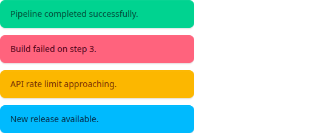<br><b>Alert</b></a><br>
<sub>Status messages and notifications</sub>
</td>
<td align="center" width="200">
<a href="#avatar"><br><b>Avatar</b></a><br>
<sub>User and entity representations</sub>
</td>
<td align="center" width="200">
<a href="#badge">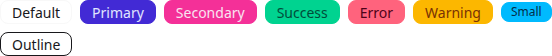<br><b>Badge</b></a><br>
<sub>Labels, counts, and status tags</sub>
</td>
</tr>
<tr>
<td align="center" width="200">
<a href="#button">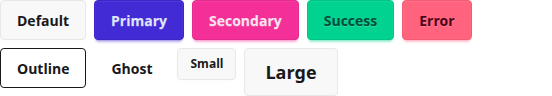<br><b>Button</b></a><br>
<sub>Actions and triggers</sub>
</td>
<td align="center" width="200">
<a href="#card">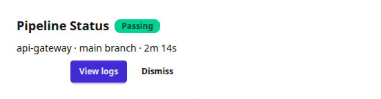<br><b>Card</b></a><br>
<sub>Content containers with body and title</sub>
</td>
<td align="center" width="200">
<a href="#checkbox">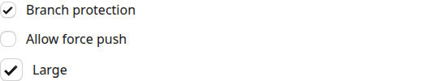<br><b>Checkbox</b></a><br>
<sub>Boolean toggles for forms</sub>
</td>
</tr>
<tr>
<td align="center" width="200">
<a href="#drawer">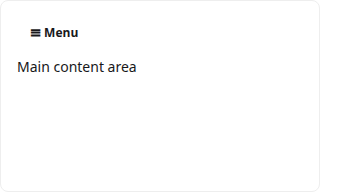<br><b>Drawer</b></a><br>
<sub>Sidebar layout with toggle</sub>
</td>
<td align="center" width="200">
<a href="#dropdown"><br><b>Dropdown</b></a><br>
<sub>Context menus and action lists</sub>
</td>
<td align="center" width="200">
<a href="#fieldset">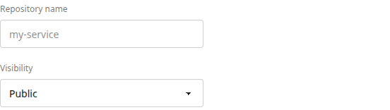<br><b>Fieldset</b></a><br>
<sub>Groups related form controls</sub>
</td>
</tr>
<tr>
<td align="center" width="200">
<a href="#indicator"><br><b>Indicator</b></a><br>
<sub>Overlays badges on elements</sub>
</td>
<td align="center" width="200">
<a href="#input">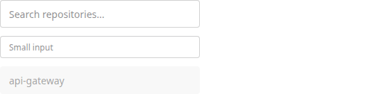<br><b>Input</b></a><br>
<sub>Text entry fields</sub>
</td>
<td align="center" width="200">
<a href="#join">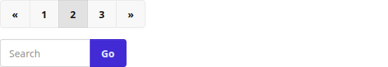<br><b>Join</b></a><br>
<sub>Groups buttons and inputs together</sub>
</td>
</tr>
<tr>
<td align="center" width="200">
<a href="#label">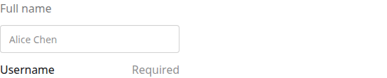<br><b>Label</b></a><br>
<sub>Field labels and helper text</sub>
</td>
<td align="center" width="200">
<a href="#link"><br><b>Link</b></a><br>
<sub>Styled anchor elements</sub>
</td>
<td align="center" width="200">
<a href="#menu">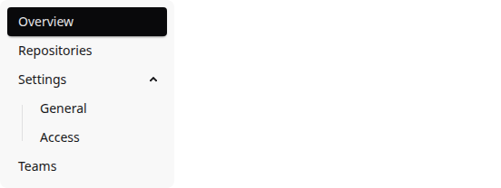<br><b>Menu</b></a><br>
<sub>Navigation lists with submenus</sub>
</td>
</tr>
<tr>
<td align="center" width="200">
<a href="#radio">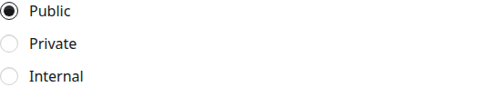<br><b>Radio</b></a><br>
<sub>Single-choice option groups</sub>
</td>
<td align="center" width="200">
<a href="#range">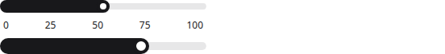<br><b>Range</b></a><br>
<sub>Slider for numeric ranges</sub>
</td>
<td align="center" width="200">
<a href="#select">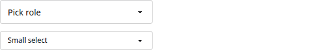<br><b>Select</b></a><br>
<sub>Dropdown option pickers</sub>
</td>
</tr>
<tr>
<td align="center" width="200">
<a href="#stats">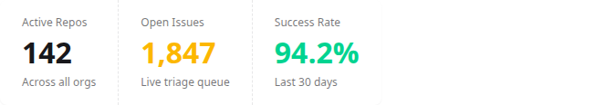<br><b>Stats</b></a><br>
<sub>Key metrics and numbers</sub>
</td>
<td align="center" width="200">
<a href="#swap"><br><b>Swap</b></a><br>
<sub>Toggle between two states</sub>
</td>
<td align="center" width="200">
<a href="#table">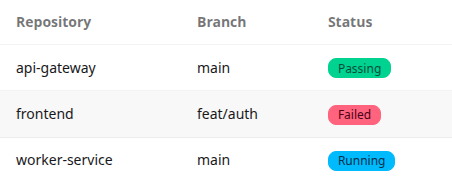<br><b>Table</b></a><br>
<sub>Structured data in rows</sub>
</td>
</tr>
<tr>
<td align="center" width="200">
<a href="#toggle"><br><b>Toggle</b></a><br>
<sub>Switch-style boolean input</sub>
</td>
<td align="center" width="200">
<a href="#modal"><br><b>Modal</b></a><br>
<sub>Modal dialogs</sub>
</td>
<td align="center" width="200"></td>
</tr>
</table>

---

## Common parameters

Every component accepts these escape-hatch parameters:

| Parameter | Type | Description |
|---|---|---|
| `extraClasses` | `String?` | Additional CSS classes, merged safely (no duplicates) |
| `attrs` | `(TAG.() -> Unit)?` | Direct access to the underlying kotlinx.html tag |
| `content` | `(TAG.() -> Unit)?` | Nested HTML content |

## Requirements

- JDK: see [`.tool-versions`](../.tool-versions) → `java` (toolchain configured in [`buildSrc/.../kdaisyui.kotlin-library-conventions.gradle.kts`](../buildSrc/src/main/kotlin/kdaisyui.kotlin-library-conventions.gradle.kts))
- Kotlin: see [`gradle.properties`](../gradle.properties) → `versions.kotlin`
- kotlinx-html: see [`gradle.properties`](../gradle.properties) → `versions.kotlinx-html`

---

## Alert


Informs users about important events. Renders `<div role="alert" class="alert ...">`.

```kotlin
fun FlowContent.daisyAlert(
    variant: AlertVariant? = null,   // Info | Success | Warning | Error
    dash: Boolean = false,
    horizontal: Boolean = false,
    outline: Boolean = false,
    soft: Boolean = false,
    vertical: Boolean = false,
    extraClasses: String? = null,
    attrs: (DIV.() -> Unit)? = null,
    content: (DIV.() -> Unit),
)
```

```kotlin
daisyAlert(variant = AlertVariant.Success) {
    span { +"Pipeline completed successfully." }
}
daisyAlert(variant = AlertVariant.Error, soft = true) {
    span { +"Build failed on step 3." }
}
daisyAlert(variant = AlertVariant.Warning, horizontal = true) {
    span { +"Check your configuration." }
}
```

---

## Avatar


Displays user or entity images. Renders `<div class="avatar">`.

```kotlin
fun FlowContent.daisyAvatar(
    offline: Boolean = false,
    online: Boolean = false,
    placeholder: Boolean = false,
    extraClasses: String? = null,
    attrs: (DIV.() -> Unit)? = null,
    content: (DIV.() -> Unit),
)
```

```kotlin
daisyAvatar {
    div("w-16 rounded-full") {
        img(src = "https://example.com/photo.jpg")
    }
}
// With mask shape:
daisyAvatar {
    div("w-16 mask mask-squircle") {
        img(src = "https://example.com/photo.jpg")
    }
}
// Online indicator:
daisyAvatar(online = true) {
    div("w-12 rounded-full") { img(src = "user.jpg") }
}
```

---

## Badge


Labels, counts, and status indicators. Renders `<span class="badge ...">`.

```kotlin
fun FlowContent.daisyBadge(
    text: String? = null,
    variant: BadgeVariant? = null,   // Neutral | Primary | Secondary | Accent | Info | Success | Warning | Error
    size: BadgeSize? = null,         // Xs | Sm | Md | Lg | Xl
    dash: Boolean = false,
    ghost: Boolean = false,
    outline: Boolean = false,
    soft: Boolean = false,
    extraClasses: String? = null,
    attrs: (SPAN.() -> Unit)? = null,
    content: (SPAN.() -> Unit)? = null,
)
```

```kotlin
daisyBadge("Passing", variant = BadgeVariant.Success)
daisyBadge("3", variant = BadgeVariant.Error, size = BadgeSize.Sm)
daisyBadge("Draft", outline = true)
daisyBadge("New", variant = BadgeVariant.Primary, soft = true)
```

---

## Button


Actions and triggers. Renders `<button class="btn ...">`.

```kotlin
fun FlowContent.daisyButton(
    text: String? = null,
    variant: ButtonVariant? = null,  // Neutral | Primary | Secondary | Accent | Info | Success | Warning | Error
    size: ButtonSize? = null,        // Xs | Sm | Md | Lg | Xl
    active: Boolean = false,
    block: Boolean = false,
    circle: Boolean = false,
    dash: Boolean = false,
    ghost: Boolean = false,
    link: Boolean = false,
    outline: Boolean = false,
    soft: Boolean = false,
    square: Boolean = false,
    wide: Boolean = false,
    disabled: Boolean = false,
    type: ButtonType? = null,
    extraClasses: String? = null,
    attrs: (BUTTON.() -> Unit)? = null,
    content: (BUTTON.() -> Unit)? = null,
)
```

```kotlin
daisyButton("Deploy", variant = ButtonVariant.Primary)
daisyButton("Cancel", variant = ButtonVariant.Ghost)
daisyButton("Delete", variant = ButtonVariant.Error, outline = true, size = ButtonSize.Sm)
daisyButton("Soft", variant = ButtonVariant.Primary, soft = true)
daisyButton("Dashed", variant = ButtonVariant.Secondary, dash = true)
```

---

## Card


Content containers. Renders `<div class="card">`, `<div class="card-body">`, `<h2 class="card-title">`.

```kotlin
fun FlowContent.daisyCard(
    size: CardSize? = null,          // Xs | Sm | Md | Lg | Xl
    border: Boolean = false,
    dash: Boolean = false,
    imageFull: Boolean = false,
    side: Boolean = false,
    extraClasses: String? = null,
    attrs: (DIV.() -> Unit)? = null,
    content: (DIV.() -> Unit),
)
fun FlowContent.daisyCardTitle(text: String? = null, extraClasses, attrs, content: (H2.() -> Unit)?)
fun FlowContent.daisyCardBody(extraClasses, attrs, content: (DIV.() -> Unit))
fun FlowContent.daisyCardActions(extraClasses, attrs, content: (DIV.() -> Unit))
```

```kotlin
daisyCard(extraClasses = "bg-base-100 shadow-xs") {
    daisyCardBody {
        daisyCardTitle {
            +"Pipeline Status"
            daisyBadge("Passing", variant = BadgeVariant.Success, size = BadgeSize.Sm)
        }
        p { +"api-gateway · main · 2m 14s" }
        daisyCardActions {
            daisyButton("View logs", variant = ButtonVariant.Primary, size = ButtonSize.Sm)
        }
    }
}
// Card with image on side
daisyCard(side = true, extraClasses = "bg-base-100 shadow-xl") {
    figure { img(src = "card.jpg") }
    daisyCardBody { /* ... */ }
}
```

---

## Checkbox


Boolean selection for forms. Renders `<input type="checkbox" class="checkbox ...">`.

```kotlin
fun FlowContent.daisyCheckbox(
    variant: CheckboxVariant? = null,  // Primary | Secondary | Accent | Neutral | Success | Warning | Info | Error
    size: CheckboxSize? = null,        // Xs | Sm | Md | Lg | Xl
    checked: Boolean = false,
    disabled: Boolean = false,
    extraClasses: String? = null,
    attrs: (INPUT.() -> Unit)? = null,
)
```

```kotlin
label("flex cursor-pointer gap-4") {
    daisyCheckbox(size = CheckboxSize.Sm, checked = true)
    span("label-text") { +"Branch protection enabled" }
}
label("flex cursor-pointer gap-4") {
    daisyCheckbox(variant = CheckboxVariant.Success, checked = true)
    span("label-text") { +"Feature enabled" }
}
```

---

## Drawer


Sidebar layout with mobile toggle. Renders a `<div class="drawer">` with a hidden checkbox controller.

```kotlin
fun FlowContent.daisyDrawer(
    end: Boolean = false,
    open: Boolean = false,
    extraClasses: String? = null,
    attrs: (DIV.() -> Unit)? = null,
    content: (DIV.() -> Unit),
)
fun FlowContent.daisyDrawerToggle(extraClasses, attrs, content: (DIV.() -> Unit))
fun FlowContent.daisyDrawerContent(extraClasses, attrs, content: (DIV.() -> Unit))
fun FlowContent.daisyDrawerSide(extraClasses, attrs, content: (DIV.() -> Unit))
fun FlowContent.daisyDrawerOverlay(extraClasses, attrs, content: (LABEL.() -> Unit))
```

```kotlin
daisyDrawer(extraClasses = "lg:drawer-open") {
    daisyDrawerToggle {
        input { id = "sidebar"; type = InputType.checkBox; classes = setOf("drawer-toggle") }
    }
    daisyDrawerContent {
        main("p-6") {
            h1 { +"Page content" }
        }
    }
    daisyDrawerSide {
        daisyDrawerOverlay { htmlFor = "sidebar" }
        nav("bg-base-100 min-h-screen w-72 p-4") {
            daisyMenu { li { a { +"Overview" } } }
        }
    }
}
```

`lg:drawer-open` keeps the sidebar permanently visible on large screens. On smaller screens, the checkbox toggle shows and hides it.

---

## Dropdown


Context menus that open on click. Renders `<details class="dropdown ...">` (uses native `<details>` element for accessibility).

```kotlin
fun FlowContent.daisyDropdown(
    close: Boolean = false,
    hover: Boolean = false,
    open: Boolean = false,
    end: Boolean = false,
    start: Boolean = false,
    top: Boolean = false,
    bottom: Boolean = false,
    left: Boolean = false,
    right: Boolean = false,
    center: Boolean = false,
    extraClasses: String? = null,
    attrs: (DETAILS.() -> Unit)? = null,
    content: (DETAILS.() -> Unit),
)
fun FlowContent.daisyDropdownContent(extraClasses, attrs, content: (DIV.() -> Unit))
```

```kotlin
daisyDropdown(end = true) {
    summary { classes = setOf("btn", "btn-sm"); +"Actions" }
    daisyDropdownContent(extraClasses = "rounded-box bg-base-100 p-2 shadow-xl") {
        ul {
            li { a { +"View details" } }
            li { a { +"Re-run pipeline" } }
        }
    }
}
```

The dropdown uses `<details>` + `<summary>` for native HTML open/close behavior. No `tabindex` required.

---

## Fieldset


Groups related form controls. Renders `<fieldset class="fieldset">`.

```kotlin
fun FlowContent.daisyFieldset(extraClasses, attrs, content: (FIELDSET.() -> Unit))
```

```kotlin
daisyFieldset {
    daisyLabel("Repository name")
    daisyInput(placeholder = "my-service", extraClasses = "w-full")
}
daisyFieldset {
    daisyLabel("Visibility")
    daisySelect(extraClasses = "w-full") {
        option { +"Public" }
        option { +"Private" }
        option { +"Internal" }
    }
}
```

---

## Indicator


Overlays a badge or element on the corner of another element. Renders `<div class="indicator">`.

```kotlin
fun FlowContent.daisyIndicator(
    bottom: Boolean = false,
    center: Boolean = false,
    end: Boolean = false,
    middle: Boolean = false,
    start: Boolean = false,
    top: Boolean = false,
    extraClasses: String? = null,
    attrs: (DIV.() -> Unit)? = null,
    content: (DIV.() -> Unit),
)
fun FlowContent.daisyIndicatorItem(extraClasses, attrs, content: (DIV.() -> Unit))
```

```kotlin
daisyIndicator {
    daisyBadge(variant = BadgeVariant.Error, size = BadgeSize.Xs, extraClasses = "indicator-item")
    daisyButton("Notifications")
}
// Top-right indicator
daisyIndicator(top = true, end = true) {
    daisyBadge("3", variant = BadgeVariant.Error, extraClasses = "indicator-item")
    daisyAvatar { div("w-16 rounded-full") { img(src = "user.jpg") } }
}
```

---

## Input


Text entry fields. Renders `<input class="input ...">`.

```kotlin
fun FlowContent.daisyInput(
    variant: InputVariant? = null,    // Neutral | Primary | Secondary | Accent | Info | Success | Warning | Error
    size: InputSize? = null,          // Xs | Sm | Md | Lg | Xl
    ghost: Boolean = false,
    type: InputType = InputType.text,
    placeholder: String? = null,
    value: String? = null,
    disabled: Boolean = false,
    extraClasses: String? = null,
    attrs: (INPUT.() -> Unit)? = null,
)
```

```kotlin
daisyInput(placeholder = "Search repositories...", extraClasses = "w-full")
daisyInput(size = InputSize.Sm, placeholder = "Branch name")
daisyInput(variant = InputVariant.Error, placeholder = "Invalid input")
```

---

## Join


Groups buttons and inputs with shared borders. Renders `<div class="join">`.

```kotlin
fun FlowContent.daisyJoin(
    horizontal: Boolean = false,
    vertical: Boolean = false,
    extraClasses: String? = null,
    attrs: (DIV.() -> Unit)? = null,
    content: (DIV.() -> Unit),
)
```

```kotlin
// Pagination
daisyJoin {
    daisyButton("«", extraClasses = "join-item")
    daisyButton("1", extraClasses = "join-item")
    daisyButton("2", variant = ButtonVariant.Primary, extraClasses = "join-item")
    daisyButton("3", extraClasses = "join-item")
    daisyButton("»", extraClasses = "join-item")
}
// Search bar
daisyJoin {
    daisyInput(placeholder = "Search", extraClasses = "join-item")
    daisyButton("Go", variant = ButtonVariant.Primary, extraClasses = "join-item")
}
// Vertical group
daisyJoin(vertical = true) {
    daisyButton("Top", extraClasses = "join-item")
    daisyButton("Bottom", extraClasses = "join-item")
}
```

Add `join-item` via `extraClasses` to each child element.

---

## Label


Field labels and helper text. Renders `<span class="label">`.

```kotlin
fun FlowContent.daisyLabel(
    text: String? = null,
    extraClasses: String? = null,
    attrs: (SPAN.() -> Unit)? = null,
    content: (SPAN.() -> Unit)? = null,
)
```

```kotlin
daisyFieldset {
    daisyLabel {
        span("label-text") { +"Card number" }
        span("label-text text-base-content/50") { +"Required" }
    }
    daisyInput(extraClasses = "w-full font-mono")
}
```

---

## Link


Styled anchor elements. Renders `<a class="link ...">`.

```kotlin
fun FlowContent.daisyLink(
    text: String? = null,
    variant: LinkVariant? = null,    // Neutral | Primary | Secondary | Accent | Success | Info | Warning | Error
    hover: Boolean = false,          // underline only on hover
    extraClasses: String? = null,
    attrs: (A.() -> Unit)? = null,
    content: (A.() -> Unit)? = null,
)
```

```kotlin
daisyLink("View all repositories", hover = true, href = "/repos")
daisyLink("Revenue report →", hover = true, extraClasses = "text-xs")
daisyLink("Important", variant = LinkVariant.Primary)
```

---

## Menu


Navigation lists with optional nested submenus. Renders `<ul class="menu">`.

```kotlin
fun FlowContent.daisyMenu(
    size: MenuSize? = null,          // Xs | Sm | Md | Lg | Xl
    active: Boolean = false,
    disabled: Boolean = false,
    dropdownShow: Boolean = false,
    focus: Boolean = false,
    horizontal: Boolean = false,
    vertical: Boolean = false,
    extraClasses: String? = null,
    attrs: (UL.() -> Unit)? = null,
    content: (UL.() -> Unit),
)
fun FlowContent.daisyMenuTitle(text: String? = null, extraClasses, attrs, content: (H2.() -> Unit)?)
fun FlowContent.daisyMenuDropdown(extraClasses, attrs, content: (DIV.() -> Unit))
fun FlowContent.daisyMenuDropdownToggle(extraClasses, attrs, content: (DIV.() -> Unit))
```

```kotlin
daisyMenu(extraClasses = "w-56 bg-base-200 rounded-box") {
    li { a("menu-active") { +"Overview" } }
    li { a { +"Repositories" } }
    li {
        details {
            summary { +"Settings" }
            ul {
                li { a { +"General" } }
                li { a { +"Access" } }
            }
        }
    }
    li {
        a {
            +"Messages"
            daisyBadge("5", variant = BadgeVariant.Info, size = BadgeSize.Sm)
        }
    }
}
```

---

## Radio


Single-choice option groups. Renders `<input type="radio" class="radio ...">`.

```kotlin
fun FlowContent.daisyRadio(
    variant: RadioVariant? = null,   // Primary | Secondary | Accent | Neutral | Success | Warning | Info | Error
    size: RadioSize? = null,        // Xs | Sm | Md | Lg | Xl
    name: String? = null,
    checked: Boolean = false,
    disabled: Boolean = false,
    extraClasses: String? = null,
    attrs: (INPUT.() -> Unit)? = null,
)
```

```kotlin
for ((value, label) in listOf("public" to "Public", "private" to "Private", "internal" to "Internal")) {
    label("flex cursor-pointer gap-3") {
        daisyRadio(name = "visibility", size = RadioSize.Sm)
        span("label-text") { +label }
    }
}
```

---

## Range


Slider for numeric input. Renders `<input type="range" class="range ...">`.

```kotlin
fun FlowContent.daisyRange(
    variant: RangeVariant? = null,   // Primary | Secondary | Accent | Neutral | Success | Warning | Info | Error
    size: RangeSize? = null,         // Xs | Sm | Md | Lg | Xl
    min: String? = null,
    max: String? = null,
    value: String? = null,
    step: String? = null,
    disabled: Boolean = false,
    extraClasses: String? = null,
    attrs: (INPUT.() -> Unit)? = null,
)
```

```kotlin
daisyRange(size = RangeSize.Xs, min = "0", max = "100", value = "40", step = "25")
div("flex justify-between text-xs px-1") {
    for (v in listOf("0", "25", "50", "75", "100")) { span { +v } }
}
```

---

## Select


Dropdown option pickers. Renders `<select class="select ...">`.

```kotlin
fun FlowContent.daisySelect(
    variant: SelectVariant? = null,   // Neutral | Primary | Secondary | Accent | Info | Success | Warning | Error
    size: SelectSize? = null,         // Xs | Sm | Md | Lg | Xl
    ghost: Boolean = false,
    disabled: Boolean = false,
    extraClasses: String? = null,
    attrs: (SELECT.() -> Unit)? = null,
    content: (SELECT.() -> Unit),
)
```

```kotlin
daisySelect(extraClasses = "w-full") {
    option { disabled = true; selected = true; +"Choose role" }
    option { +"Owner" }
    option { +"Maintainer" }
    option { +"Developer" }
    option { +"Reporter" }
}
daisySelect(variant = SelectVariant.Primary, size = SelectSize.Sm) {
    option { +"Option A" }
    option { +"Option B" }
}
```

---

## Stats


Key metrics displayed in a horizontal or vertical strip. Renders `<div class="stats">`.

```kotlin
fun FlowContent.daisyStat(
    horizontal: Boolean = false,
    vertical: Boolean = false,
    extraClasses: String? = null,
    attrs: (DIV.() -> Unit)? = null,
    content: (DIV.() -> Unit),
)
fun FlowContent.daisyStatStat(extraClasses, attrs, content: (DIV.() -> Unit))
fun FlowContent.daisyStatStatTitle(text: String? = null, extraClasses, attrs, content: (DIV.() -> Unit)?)
fun FlowContent.daisyStatStatValue(text: String? = null, extraClasses, attrs, content: (DIV.() -> Unit)?)
fun FlowContent.daisyStatStatDesc(text: String? = null, extraClasses, attrs, content: (DIV.() -> Unit)?)
fun FlowContent.daisyStatStatFigure(extraClasses, attrs, content: (DIV.() -> Unit))
fun FlowContent.daisyStatStatActions(extraClasses, attrs, content: (DIV.() -> Unit))
```

```kotlin
daisyStat(horizontal = true, extraClasses = "shadow-xs") {
    daisyStatStat {
        daisyStatStatTitle("Active Repos")
        daisyStatStatValue("142")
        daisyStatStatDesc("Across all organizations")
    }
    daisyStatStat {
        daisyStatStatTitle("Open Issues")
        daisyStatStatValue("1,847")
        daisyStatStatDesc("Live triage queue")
    }
    daisyStatStat {
        daisyStatStatTitle("Pipeline Success Rate")
        daisyStatStatValue("94.2%")
        daisyStatStatDesc("Last 30 days")
    }
}
```

---

## Swap


Toggles between two visual states via a hidden checkbox. Renders `<label class="swap ...">`.

```kotlin
fun FlowContent.daisySwap(
    rotate: Boolean = false,
    flip: Boolean = false,
    extraClasses, attrs,
    content: (LABEL.() -> Unit),
)
```

```kotlin
// Theme toggle
daisySwap(rotate = true) {
    span("swap-on text-2xl") { +"🌙" }
    span("swap-off text-2xl") { +"☀️" }
}
// Text toggle
daisySwap {
    span("swap-on font-bold") { +"ON" }
    span("swap-off text-base-content/40") { +"OFF" }
}
```

---

## Table


Structured data in rows and columns. Renders `<table class="table ...">`.

```kotlin
fun FlowContent.daisyTable(
    zebra: Boolean = false,       // alternating row background
    pin: Boolean = false,         // sticky header rows
    extraClasses, attrs,
    content: (TABLE.() -> Unit),
)
```

```kotlin
daisyTable(zebra = true) {
    thead {
        tr { th { +"Repository" }; th { +"Branch" }; th { +"Status" } }
    }
    tbody {
        tr {
            td { +"api-gateway" }
            td { +"main" }
            td { daisyBadge("Passing", variant = BadgeVariant.Success, size = BadgeSize.Sm) }
        }
        tr {
            td { +"frontend" }
            td { +"feat/auth" }
            td { daisyBadge("Failed", variant = BadgeVariant.Error, size = BadgeSize.Sm) }
        }
    }
}
```

---

## Toggle


Switch-style boolean input. Renders `<input type="checkbox" class="toggle ...">`.

```kotlin
fun FlowContent.daisyToggle(
    variant: ToggleVariant? = null,   // Primary | Secondary | Accent | Neutral | Success | Warning | Info | Error
    size: ToggleSize? = null,         // Xs | Sm | Md | Lg | Xl
    checked: Boolean = false,
    disabled: Boolean = false,
    extraClasses: String? = null,
    attrs: (INPUT.() -> Unit)? = null,
)
```

```kotlin
label("flex cursor-pointer justify-between") {
    span("label-text") { +"Pipeline notifications" }
    daisyToggle(checked = true)
}
label("flex cursor-pointer justify-between") {
    span("label-text") { +"Allow force push" }
    daisyToggle(size = ToggleSize.Sm, variant = ToggleVariant.Primary)
}
```

---

## Modal

Modal dialogs. Renders `<dialog class="modal ...">`.

```kotlin
fun FlowContent.daisyModal(
    bottom: Boolean = false,
    end: Boolean = false,
    middle: Boolean = false,
    open: Boolean = false,
    start: Boolean = false,
    top: Boolean = false,
    extraClasses: String? = null,
    attrs: (DIALOG.() -> Unit)? = null,
    content: (DIALOG.() -> Unit),
)
fun FlowContent.daisyModalBox(extraClasses, attrs, content: (DIV.() -> Unit))
fun FlowContent.daisyModalAction(extraClasses, attrs, content: (DIV.() -> Unit))
fun FlowContent.daisyModalBackdrop(extraClasses, attrs, content: (DIV.() -> Unit))
```

```kotlin
// Modal with form
daisyModal(open = true) {
    daisyModalBox {
        h3("text-lg font-bold") { +"Edit Profile" }
        p("py-4") { +"Press ESC key or click the button below to close" }
        daisyModalAction {
            daisyButton("Close", variant = ButtonVariant.Ghost)
        }
    }
    daisyModalBackdrop { }
}
// Centered modal
daisyModal(middle = true) {
    daisyModalBox { /* content */ }
    daisyModalBackdrop { }
}
```

Use `open = true` to show the modal. The `daisyModalBackdrop` provides the clickable overlay to close.

---

## Core utility

### `addClassNames` — `com.github.ollin.kdaisyui.core`

```kotlin
fun Tag.addClassNames(vararg classNames: String)
fun Tag.addClassNames(classNames: String?)
```

Merges CSS class tokens into the `class` attribute safely: deduplicates, handles null and whitespace, preserves insertion order. Used internally by all components. Also available for raw kotlinx.html elements:

```kotlin
div {
    addClassNames("flex items-center gap-4")
}
```
