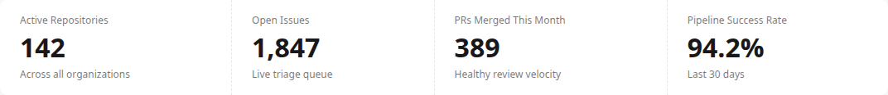
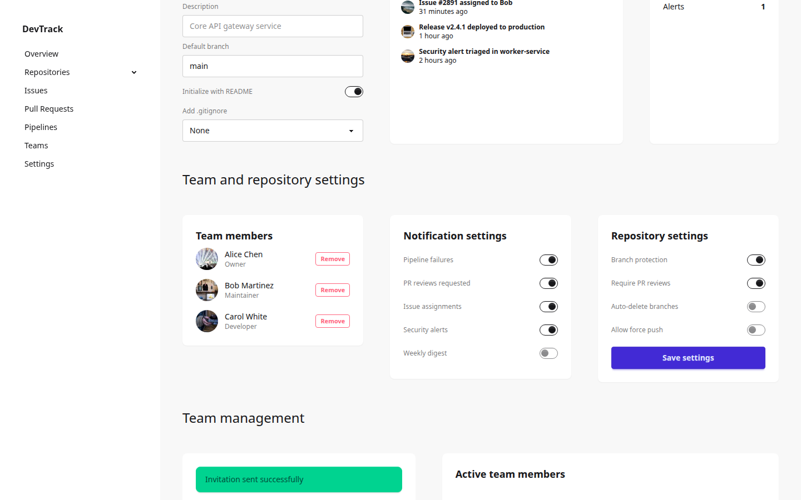
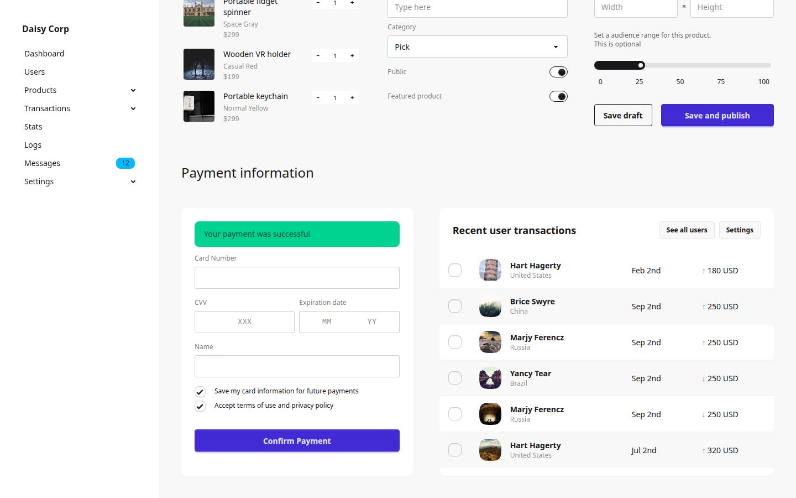

# Build a dashboard with Ktor and htmx

In this tutorial we will build a full admin dashboard served by Ktor. The page loads progressively — the shell appears instantly, then sections load in the background as the user scrolls. No JavaScript framework needed.

We will use three things:

- **Ktor** serves HTML pages and fragments
- **kdaisyUI** provides the component DSL
- **htmx** makes the browser fetch fragments and swap them into the page

## What we will build

An admin dashboard with:

- A sidebar with navigation
- A header with search
- Stats cards (loaded immediately)
- Data tables and charts (loaded after a short delay)
- Forms and payment section (loaded when scrolled into view)


## 1. Create the project

Create a new Gradle module (or a standalone project) with these dependencies.

**build.gradle.kts**

```kotlin
plugins {
    kotlin("jvm") version "2.3.10"
    application
}

application {
    mainClass.set("MainKt")
}

repositories {
    mavenCentral()
}

dependencies {
    // kdaisyUI (via composite build or local project)
    implementation(project(":lib"))

    // Ktor server
    implementation("io.ktor:ktor-server-core:3.4.2")
    implementation("io.ktor:ktor-server-netty:3.4.2")
    implementation("io.ktor:ktor-server-html-builder:3.4.2")

    // Logging
    implementation("ch.qos.logback:logback-classic:1.5.18")
}
```

## 2. Create the entry point

**src/main/kotlin/Main.kt**

```kotlin
import io.ktor.server.engine.*
import io.ktor.server.netty.*
import io.ktor.server.routing.*

fun main() {
    embeddedServer(Netty, port = 8080) {
        routing {
            dashboardRoutes()
        }
    }.start(wait = true)
}
```

We will define `dashboardRoutes()` next.

## 3. Serve the page shell

The shell is the outer frame: `<html>`, `<head>`, sidebar, header, and placeholder divs for content sections. This loads first and gives the user something to see immediately.

**src/main/kotlin/Routes.kt**

```kotlin
import io.ktor.http.*
import io.ktor.server.html.*
import io.ktor.server.response.*
import io.ktor.server.routing.*
import kdaisyui.components.*
import kdaisyui.core.addClassNames
import kotlinx.html.*
import kotlinx.html.stream.appendHTML

fun Route.dashboardRoutes() {
    get("/") {
        call.respondHtml(HttpStatusCode.OK) { shellPage() }
    }
}
```

Now let's build the shell. We load DaisyUI and htmx from CDN — no build step required:

```kotlin
fun HTML.shellPage() {
    lang = "en"
    head {
        meta { charset = "utf-8" }
        title { +"Dashboard" }
        meta { name = "viewport"; content = "width=device-width, initial-scale=1" }

        // DaisyUI + Tailwind CSS from CDN
        link { rel = "stylesheet"; href = "https://cdn.jsdelivr.net/npm/daisyui@5/daisyui.css" }
        link { rel = "stylesheet"; href = "https://cdn.jsdelivr.net/npm/daisyui@5/themes.css" }
        script { src = "https://cdn.jsdelivr.net/npm/@tailwindcss/browser@4" }

        // htmx from CDN
        script { src = "https://cdn.jsdelivr.net/npm/htmx.org@2.0.4/dist/htmx.min.js" }
    }
    body("drawer bg-base-200 lg:drawer-open min-h-screen") {
        input { id = "my-drawer"; type = InputType.checkBox; classes = setOf("drawer-toggle") }

        main("drawer-content") {
            div("grid grid-cols-12 gap-y-12 p-4 lg:gap-x-12 lg:p-10") {
                shellHeader()
                // Placeholder divs — we will add htmx attributes next
            }
        }

        aside("drawer-side z-10") {
            label { htmlFor = "my-drawer"; classes = setOf("drawer-overlay") }
            shellSidebar()
        }
    }
}
```

## 4. Build the sidebar

The sidebar uses `daisyMenu` for navigation items:

```kotlin
fun FlowContent.shellSidebar() {
    nav("bg-base-100 flex min-h-screen w-72 flex-col px-6 py-10") {
        div("mx-4 flex items-center gap-2 font-black") { +"My App" }
        daisyMenu(extraClasses = "w-full") {
            li { a("menu-active") { +"Dashboard" } }
            li { a { +"Users" } }
            li { a { +"Stats" } }
            li {
                a {
                    +"Messages"
                    daisyBadge("5", variant = BadgeVariant.Info, size = BadgeSize.Sm)
                }
            }
            li {
                details {
                    summary { +"Settings" }
                    ul {
                        li { a { +"General" } }
                        li { a { +"Themes" } }
                    }
                }
            }
        }
    }
}
```

## 5. Build the header

```kotlin
fun FlowContent.shellHeader() {
    header("col-span-12 flex items-center gap-2 lg:gap-4") {
        label {
            htmlFor = "my-drawer"
            classes = setOf("btn", "btn-square", "btn-ghost", "drawer-button", "lg:hidden")
            +"☰"
        }
        div("grow") {
            h1("lg:text-2xl lg:font-light") { +"Dashboard" }
        }
        daisyInput(size = InputSize.Sm, placeholder = "Search", extraClasses = "rounded-full")
    }
}
```

At this point, run the server with `./gradlew run` and open http://localhost:8080. You should see the sidebar and header. The content area is empty — we will fill it next.

## 6. Add stats directly

Before introducing htmx, let's render stats directly in the shell to make sure they work:

```kotlin
// Inside the grid div, after shellHeader()
section("stats stats-vertical xl:stats-horizontal bg-base-100 col-span-12 w-full shadow-xs") {
    daisyStat {
        daisyStatTitle("Page Views")
        daisyStatValue("89,400")
        daisyStatDesc("21% more than last month")
    }
    daisyStat {
        daisyStatTitle("Users")
        daisyStatValue("1,200")
        daisyStatDesc("12% increase")
    }
}
```

Refresh the page. You should see the stats section.



## 7. Move stats to a fragment

Now let's introduce htmx. The idea: instead of rendering the stats inside the shell, we create a separate endpoint that returns just the stats HTML. The browser fetches it automatically after the page loads.

**Step 1**: Create a helper to return HTML fragments (not full documents):

```kotlin
suspend fun RoutingCall.respondHtmlFragment(block: TagConsumer<*>.() -> Unit) {
    val html = buildString { appendHTML(prettyPrint = false).apply(block) }
    respondText(html, ContentType.Text.Html)
}
```

**Step 2**: Add the fragment endpoint:

```kotlin
fun Route.dashboardRoutes() {
    get("/") {
        call.respondHtml(HttpStatusCode.OK) { shellPage() }
    }
    get("/fragments/stats") {
        call.respondHtmlFragment {
            section {
                addClassNames("stats stats-vertical xl:stats-horizontal bg-base-100 col-span-12 w-full shadow-xs")
                daisyStat {
                    daisyStatTitle("Page Views")
                    daisyStatValue("89,400")
                    daisyStatDesc("21% more than last month")
                }
                daisyStat {
                    daisyStatTitle("Users")
                    daisyStatValue("1,200")
                    daisyStatDesc("12% increase")
                }
            }
        }
    }
}
```

**Step 3**: Replace the stats section in the shell with a placeholder:

```kotlin
// Instead of the stats section, add this placeholder:
div("col-span-12") {
    attributes["hx-get"] = "/fragments/stats"
    attributes["hx-trigger"] = "load"
    attributes["hx-swap"] = "outerHTML"
    span("loading loading-spinner loading-lg") {}
}
```

Three attributes make this work:

- `hx-get="/fragments/stats"` tells htmx which URL to fetch
- `hx-trigger="load"` tells htmx to fetch immediately when the page loads
- `hx-swap="outerHTML"` tells htmx to replace the entire placeholder div with the response

Refresh the page. You should see a brief spinner, then the stats appear. Open the browser's network tab — you will see a separate request to `/fragments/stats`.

## 8. Add more fragment sections

Follow the same pattern for additional sections. Here's a transactions table:

```kotlin
get("/fragments/transactions") {
    call.respondHtmlFragment {
        section {
            addClassNames("card bg-base-100 col-span-12 overflow-hidden shadow-xs")
            daisyCardBody(extraClasses = "grow-0") {
                daisyCardTitle { daisyLink("Transactions", hover = true) }
            }
            div("overflow-x-auto") {
                daisyTable(zebra = true) {
                    tbody {
                        tr { td { +"Hart Hagerty" }; td { +"Feb 2nd" }; td { +"180 USD" } }
                        tr { td { +"Brice Swyre" }; td { +"Sep 2nd" }; td { +"250 USD" } }
                    }
                }
            }
        }
    }
}
```

Add a placeholder in the shell:

```kotlin
div("col-span-12") {
    attributes["hx-get"] = "/fragments/transactions"
    attributes["hx-trigger"] = "load delay:100ms"
    attributes["hx-swap"] = "outerHTML"
    span("loading loading-spinner loading-lg") {}
}
```

The `delay:100ms` makes the transactions load slightly after the stats, creating a staggered effect.

## 9. Lazy-load below-the-fold content

For sections that are below the fold (the user needs to scroll to see them), use `hx-trigger="revealed"`:

```kotlin
div("col-span-12") {
    attributes["hx-get"] = "/fragments/forms"
    attributes["hx-trigger"] = "revealed"
    attributes["hx-swap"] = "outerHTML"
    span("loading loading-spinner loading-lg") {}
}
```

htmx watches the viewport. When the user scrolls down and the placeholder becomes visible, htmx fetches the content. This means sections below the fold are never loaded unless the user actually scrolls to them.

## 10. Run the complete example

The `example-app` module in the kdaisyUI repository contains a complete working dashboard with all sections, sidebar, and progressive loading. Run it:

```bash
./gradlew :example-app:run
```

Open http://localhost:8080 and watch the network tab. You will see:

1. The shell HTML loads (sidebar, header, placeholders with spinners)
2. `/fragments/stats` loads immediately
3. `/fragments/cards-row1` loads after 100ms
4. Lower sections load as you scroll


Scrolling down reveals the forms section:



And further down, the payment section:



## What you learned

- **Ktor** serves both full pages (`respondHtml`) and fragments (`respondHtmlFragment`)
- **kdaisyUI** generates DaisyUI markup from Kotlin — same components work in both full pages and fragments
- **htmx** handles progressive loading with three attributes: `hx-get`, `hx-trigger`, `hx-swap`
- `"load"` fetches immediately, `"revealed"` fetches on scroll
- `"outerHTML"` swap replaces the placeholder cleanly

The server is the single source of truth for all rendering. No client-side JavaScript framework, no JSON APIs, no build steps for CSS (CDN). Just Kotlin on the server.
