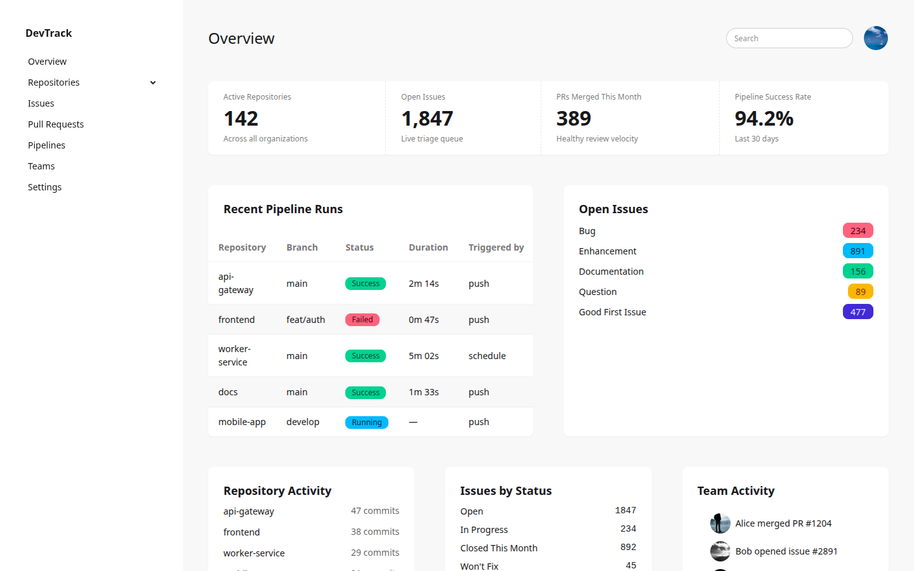

# Getting started with kdaisyUI

In this tutorial we will render our first DaisyUI components from Kotlin. By the end you will have a small program that generates a styled card with stats, a form, and buttons — all type-safe, all from Kotlin.

## Prerequisites

- JDK 21+ (the Gradle toolchain downloads it automatically — exact version in [`.tool-versions`](../../.tool-versions))
- Gradle (the wrapper `./gradlew` downloads it — exact version in [`gradle/wrapper/gradle-wrapper.properties`](../../gradle/wrapper/gradle-wrapper.properties))
- Basic Kotlin knowledge

## 1. Set up the project

Create a new directory and add the minimal Gradle files.

**settings.gradle.kts**

```kotlin
rootProject.name = "my-app"
includeBuild("../kdaisyUI")   // point to where you cloned kdaisyUI
```

**build.gradle.kts**

```kotlin
plugins {
    // current Kotlin version: see gradle.properties → versions.kotlin
    kotlin("jvm") version "«versions.kotlin»"
}

repositories {
    mavenCentral()
}

dependencies {
    implementation(project(":lib"))
    // current kotlinx-html version: see gradle.properties → versions.kotlinx-html
    implementation("org.jetbrains.kotlinx:kotlinx-html-jvm:«versions.kotlinx-html»")
}
```

> Replace `«versions.kotlin»` and `«versions.kotlinx-html»` with the values from
> [`gradle.properties`](../../gradle.properties) in the kdaisyUI repository.

Run `./gradlew build` to verify everything resolves.

## 2. Render a button

Create `src/main/kotlin/Main.kt`:

```kotlin
import com.github.ollin.kdaisyui.components.*
import kotlinx.html.*
import kotlinx.html.stream.createHTML

fun main() {
    val html = createHTML(prettyPrint = false).div {
        daisyButton("Click me", variant = ButtonVariant.Primary)
    }
    println(html)
}
```

Run it:

```bash
./gradlew run
```

You should see:

```html
<div><button class="btn btn-primary">Click me</button></div>
```

`createHTML()` is a kotlinx.html function that renders HTML to a String. `daisyButton` is a kdaisyUI extension function that generates a `<button>` with the correct DaisyUI classes.

## 3. Add variants and sizes

Let's add a few more buttons to see the DSL in action:

```kotlin
val html = createHTML(prettyPrint = false).div {
    daisyButton("Primary", variant = ButtonVariant.Primary, size = ButtonSize.Lg)
    daisyButton("Outline", outline = true)
    daisyButton("Ghost", variant = ButtonVariant.Ghost, size = ButtonSize.Sm)
}
```

Output:

```html
<div>
  <button class="btn btn-primary btn-lg">Primary</button>
  <button class="btn btn-outline">Outline</button>
  <button class="btn btn-ghost btn-sm">Ghost</button>
</div>
```

Notice how each variant and size maps to a DaisyUI class. No typos possible — the compiler checks the enum values.

## 4. Build a card

Components nest naturally. Let's build a card with a title and a badge:

```kotlin
val html = createHTML(prettyPrint = false).div {
    daisyCard(extraClasses = "bg-base-100 shadow-xs") {
        daisyCardBody {
            daisyCardTitle {
                +"Orders"
                daisyBadge("3", variant = BadgeVariant.Success, size = BadgeSize.Sm)
            }
            p { +"You have 3 new orders today." }
            daisyButton("View all", variant = ButtonVariant.Primary)
        }
    }
}
```

Output:

```html
<div>
  <div class="card bg-base-100 shadow-xs">
    <div class="card-body">
      <h2 class="card-title">Orders<span class="badge badge-success badge-sm">3</span></h2>
      <p>You have 3 new orders today.</p>
      <button class="btn btn-primary">View all</button>
    </div>
  </div>
</div>
```

`daisyCard`, `daisyCardBody`, and `daisyCardTitle` are all separate functions. You compose them by nesting — just like regular kotlinx.html.

## 5. Add a stats section

Stats are a DaisyUI component that shows key metrics:

```kotlin
val html = createHTML(prettyPrint = false).div {
daisyStat(horizontal = true, extraClasses = "bg-base-100 shadow-xs w-full") {
    daisyStatStat {
        daisyStatStatTitle("Users")
        daisyStatStatValue("1,200")
        daisyStatStatDesc("12% increase")
    }
    daisyStatStat {
        daisyStatStatTitle("Revenue")
        daisyStatStatValue("$34,000")
        daisyStatStatDesc("8% increase")
    }
}
        daisyStat {
            daisyStatTitle("Revenue")
            daisyStatValue("$34,000")
            daisyStatDesc("8% increase")
        }
    }
}
```

Each `daisyStat` block produces a stat card with title, value, and description.

## 6. Build a form

Forms use fieldsets, labels, inputs, and other form components:

```kotlin
val html = createHTML(prettyPrint = false).div {
    daisyFieldset {
        daisyLabel("Email")
        daisyInput(placeholder = "you@example.com", extraClasses = "w-full")
    }
    daisyFieldset {
        daisyLabel("Role")
        daisySelect(extraClasses = "w-full") {
            option { +"Admin" }
            option { +"Editor" }
            option { +"Viewer" }
        }
    }
    daisyFieldset {
        label("flex cursor-pointer gap-4") {
            daisyCheckbox(size = CheckboxSize.Sm, checked = true)
            span("label-text") { +"Send me notifications" }
        }
    }
    daisyButton("Save", variant = ButtonVariant.Primary, extraClasses = "w-full")
}
```

Notice the pattern: `daisyFieldset` wraps each field, `daisyLabel` adds the label, and the input component goes next. For checkboxes and toggles, you wrap them in a `label` for click behavior.

## 7. Show an alert

Let's add a success alert above the form:

```kotlin
daisyAlert(variant = AlertVariant.Success) {
    span { +"Your changes have been saved." }
}
```

Output:

```html
<div role="alert" class="alert alert-success"><span>Your changes have been saved.</span></div>
```

## What you learned

- `createHTML()` renders kotlinx.html to a String
- Every kdaisyUI component is a `FlowContent` extension function — it works anywhere in kotlinx.html
- Components accept typed parameters (enums for variants/sizes, booleans for modifiers)
- `extraClasses` lets you add any CSS class (Tailwind utilities, custom classes)
- Components compose by nesting, just like HTML

## Next steps

Now that you can render components, let's build a real application. Continue with [Build a dashboard with Ktor and htmx](build-a-dashboard.md) to serve these components from a web server with progressive loading.

Here is what a full application built with kdaisyUI looks like — the DevTrack example app included in this repository:


